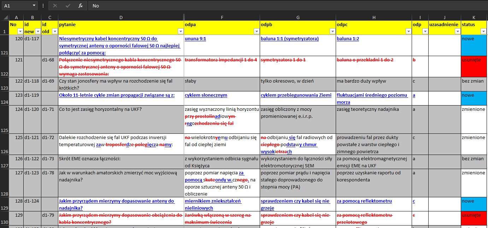
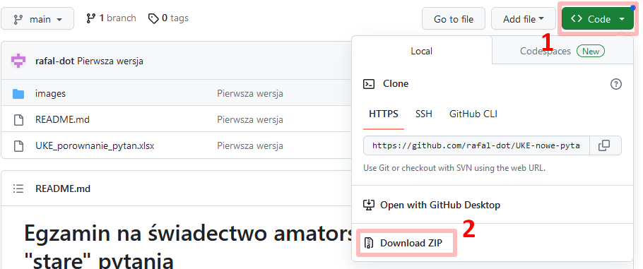

# Świadectwo amatorskie UKE: pełne porównanie "nowych" (2023) i "starych" pytań

W ostatnich dniach (wrzesień 2023) na stronie UKE pojawiła się oficjalnie
"nowa" baza pytań na egzamin na amatorskie świadectwo operatora urządzeń
radiowych. Do starej bazy stworzono wiele materiałów. Niniejsza strona powstała
po to, aby ułatwić identyfikację wiedzy, którą należy pogłębić, aby dobrze
samodzielnie przygotować się do egzaminu.  Dostępny plik excel zawiera pełne
porównanie pytań, z zaznaczeniem pytań niezmienionych, dodanych, usuniętych
oraz - w wypadku pytań zmodyfikowanych - pełną wizualizację zmian w ich treści.

# WPROWADZENIE

W ostatnich dniach pojawiła się na stronach UKE baza pytań na egzaminy na
świadectwa klas A i C operatora urządzeń radiowych w służbie
radiokomunikacyjnej amatorskiej przeprowadzanym przez Urząd Komunikacji
Elektronicznej (UKE).

"Stare" pytania składają się z ponad 400 pozycji. Stworzono do nich sporo
materiałów pomocniczych oraz gotowe zestawy z odpowiedziami (patrz sekcja z
przydatnymi łączami pod koniec pliku). Znacznie ułatwia to samodzielną naukę.

Baza "nowych" pytań składa się z ponad 500 pozycji dla świadectwa klasy A i
około 380 w klasie C. Łatwo zauważyć, że sporą jej część stanowią pytania
występujące już w "starym" zbiorze (około 180/A i 140/C), ewentualnie z
nieznacznie zmodyfikowaną treścią (około 110/A i 90/B). Część pozycji usunięto
(około 150/A i 60/C). Dodano około 220 pytań w klasie A i 140 w C. Biorąc pod
uwagę postęp technologiczny oraz mało nowoczesne podejście do niektórych
zagadnień w "starym" zbiorze, zmiany te wydają się jak najbardziej zasadne.
Jednak ich identyfikacja w tak dużym zbiorze jest utrudniona.

Wobec braku materiałów, które pokrywałby nowe zagadnienia w stopniu podobnym do
"starej" bazy, stworzyłem dla siebie niniejszy zbiór. Mi ten plik bardzo
ułatwił lepsze opanowanie materiału i przegotowanie do egzaminu, więc może
przyda się też innym.

# ZAWARTOŚĆ PLIKU `UKE_porownanie_pytan.xlsx`

Podstawowa zawartość znajduje się w pliku
[`UKE_porownanie_pytan.xlsx`](UKE_porownanie_pytan.xlsx). Zawiera on porównanie
"starych" pytań z nowymi pytaniami z bazy UKE. Najbardziej istotną zakładką
jest zakładka `porownanie`:



W dwóch pierwszych kolumnach `B` i `C` znajdują się:
- w wypadku pytań niezmienionych lub lekko zmodyfikowanych, odpowiednie
  identyfikatory ze "starego" (kolumna `C`) i "nowego" (kolumna `B`) zbioru
  pytań,
- w wypadku pytań dodanych, w kolumnie `B` znajduje się identyfikator nowego
  pytania, zaś kolumna `C` jest pusta,
- w wypadku pytań usuniętych, kolumna `C` jest pusta, zaś w kolumnie `C`
  znajduje się identyfikator starego pytania.

Zmiany w treści pytań zostały tutaj oznaczone następująco:
- dodane treści są zaznaczone <span style="color:blue"><u>na niebiesko i
  podkreślone</u></span>, 
- treści usunięte zostały zaznaczone <span style="color:red">~~na czerwono i
  przekreślone~~</span>,
- fragmenty niezmienione są zaznaczone czarną czcionką,
- całe niezmodyfikowane komórki mają szare tło.

Dodatkowo w kolumnie `K` wyróżniono różnymi kolorami pozycje `bez zmian`,
`nowe`, `usunięte` oraz `zmienione`. Podczas porównywania przyjąłem następujące
założenia:
- jeśli pytanie jest podobne w treści, jednak ma zupełnie odwrotne znaczenie -
  np. pytanie zmieniono z "***najmniejsza*** *oporność*" na "***największa***
  *oporność*" - to potraktowałem to jako zupełnie nowe pytanie, czyli stare
  zostało usunięte a nowe dodane,
- jeśli pytanie zostało przeredagowane, jednak co do merytorycznej treści
  pozostało takie samo, to uznałem, że to jest to samo pytanie, tylko ze
  zmienioną treścią. Ponieważ czasem oznacza to wiele zmian w tekście, taka treść
  może okazać się nieczytelna. Zalecam wówczas, używając kolumn `B` i `C` z
  indeksami sięgnięcie do oryginalnych treści w odpowiednich zakładkach `nowe` i
  `stare`,
- drobne różnice - np. zmiana skrótów jednostek na greckie litery czy też drobne
  literówki - starałem się modyfikować tak, aby nie były one widoczne jako zmiany.

Dodałem kolumny `L`, `M`, `N` i `O`, które umożliwiają wybranie pytań wyłącznie
na świadectwo klasy A lub C. Kolumny `N` i `O` odsyłają do kolumny `A`
odpowiednio w zakładkach `nowe` i `stare`. Warto zauważyć, że początek
identyfikatora pytania wskazuje na przedmiot, którego on dotyczy:
- `d1-` - radiotechnika,
- `d2-` - BHP,
- `d3-` - procedury i zwyczaje operatorskie,
- `d4-` - przepisy dotyczące radiokomunikacyjnej służby amatorskiej.

Ponadto w pliku są jeszcze 3 inne zakładki:
- `TYTUL` - zakładka tytułowa wraz z podstawowym opisem,
- `nowe` - zakładka z bazą "nowych" pytań. W pierwszej kolumnie jest
  identyfikator pytania stworzony za pomocą numeru rozdziału oraz
  identyfikatora z oryginalnego zbioru,
- `stare` - zakładka z bazą "starych" pytań. W pierwszej kolumnie znajdują się
  analogiczne identyfikatory, jak w poprzedniej zakładce.

Ponieważ porównanie jest przeprowadzone znak po znaku - a często oryginalne
komórki różniły się spacją lub innym pojedynczym znakiem - aby ułatwić
identyfikację różnic merytorycznych, dane zostały wyczyszczone.  Usunięto
literówki, więc porównanie skupia się na różnicach merytorycznych.

# INTERESUJE MNIE TYLKO ŚWIADECTWO KLASY C, CO MAM ZROBIĆ?

Jeśli zdajesz egzamin na świadectwo klasy C i tylko na tych pytaniach chcesz
się skupić, to w zakładce `porownanie` powinieneś w kolumnie `M` włączyć filtr,
który pokazuje wyłącznie wiersze, w których w tej kolumnie jest litera `C`.
Wówczas nie będą widoczne pytania które dotyczą świadectwa klasy A.

# CHCESZ POMÓC W ROZWIJANIU TEJ BAZY? PROSZĘ BARDZO :-)

Wszyscy jesteśmy ludźmi i pomimo tego, że starałem się jak najlepiej przygotować
ten materiał, to mogą pojawiać się błędy. Jeśli zauważysz cokolwiek, nie wahaj
się skontaktować (mój adres email znajdziesz pod koniec tego pliku). Wszelkie
zgłoszenia postaram się jak najszybciej zweryfikować i ewentualnie poprawić.
Pamiętaj jednak, że nie jestem ekspertem w tematyce radioamatorskiej a po
prostu takim jak ty amatorem, które starając się ze zrozumieniem przygotować do
egzaminu, zaczął bardziej szczegółowo analizować pytania i przygotowywać sobie
pomoce, które później zdecydowałem się udostępnić.  Pamiętaj też, że to jest
moje hobby a na co dzień zajmuję się zupełnie inną tematyką i czasem mogę nie
mieć czasu na natychmiastową reakcję :-)

Podczas przygotowywanie się do egzaminu, zauważyłem, że dostępnych jest kilka
stron z pytaniami i odpowiedziami, jednak - poza kursem kolegów z Krakowa -
brakuje materiałów, które umożliwiałyby zrozumienie odpowiedzi na pytania. Aby
tutaj pomóc dodałem kolumnę `uzasadnienie`. Ponieważ jest tam niewiele pozycji,
byłbym zobowiązany za dostarczenie treści, może uda się ten materiał rozbudować
w taki sposób, że będzie on jeszcze bardziej przydatny.

## MATERIAŁY Z ARRL

Przygotowując się do mojego egzaminu, dość intensywnie poszukiwałem aktualnej
książki w języku polskim, którą mógłbym się wesprzeć. Niestety, nie udało mi
się zidentyfikować takiej pozycji. Najnowsze kompleksowe opracowania po polsku
są dostępne jedynie w postaci skanów PDF. Niestety są one datowane na końcówkę
lat 80-tych. Ponieważ w ciąg ponad 30 lat "trochę się zmieniło" - co zresztą
odzwierciedlają pytania egzaminacyjne - skazany byłem na samodzielne
studiowanie przeróżnych źródeł informacji (na marginesie, chyba mi to wyszło na
dobre ;-). Niestety, jak powszechnie wiadomo, jakość materiałó dostępnych w
internecie jest różna. Od pozycji bardzo dobrych, do ...  no powiedzmy, takich
sobie.

W związku z powyższym pozwalam sobie polecić księgarnię kolegów z
[ARRL](https://www.arrl.org/), która zawiera całą masę interesujących pozycji
(patrz też sekcja z linkami poniżej). Niestety, dotarłem do tego źródła już po
egzaminie, ale może dla kogoś to będzie pomocne. Wiele pozycji jest regularnie
uaktualniania - część corocznie - a ich jakość jest moim zdaniem po prostu
znakomita. Wiele z nich można zakupić zarówno w wersji elektronicznej jak i
papierowej. Dodatkowo kupując wersję papierową często otrzymuje się za darmo "w
pakiecie" wersję podzieloną na wiele plików PDF(1).  "Przepuszczałem" te pliki
przez darmowe automatyczne systemy do tłumaczenia i efektu były zaskakująco
dobre. Trzeba jednak pamiętać, że rozmiar pojedynczych rozdziałów może
przekraczać limitu 10MB akceptowalny przez "tłumacza", co niestety dotyczy
pojedynczych plików(2).

Studiując powyższe materiały trzeba też pamiętać, że wiele szczegółowych
regulacji - np. dotyczących BHP, standardów branżowych czy też bandplanu - mogą
różnić się od tych obowiązujących w Polsce.

(1) O czym miałem okazję przekonać się osobiście, dotyczy to również wersji
papierowej zakupionej nie bezpośrednie ze sklepu ARRL ale np. z "dominującej na
świecie platformy e-commerce", gdzie koszty przesyłki były znacząco niższe.

(2) Obiektywnie trzeba przyznać, że łatwość i jakość automatycznych tłumaczeń
pewnie też jest istotnym powodem, dla którego nikt nie jest skłonny inwestować
pieniędzy w projekt tłumaczenia wąskich branżowych książek dla garstki
zakręconych ludzi, jaką niewątpliwie są radioamatorzy.

# JAK ŚCIĄGNĄĆ PLIK

Aby ściągnąć pliki wystarczy zrobić jedno z poniższych:

- ściągnąć skompresowane archiwum ze strony [repozytorium
  GitHub](https://github.com/rafal-dot/UKE-nowe-pytania) (patrz pola
  `Code`/`Download ZIP`):



lub

- wykonać komendę `git clone`:
```commandline
git clone https://github.com/rafal-dot/UKE-nowe-pytania.git
```

# PRZYDATNE LINKI

Niniejsze pliki można ściągnąć z [repozytorium
GitHub](https://github.com/rafal-dot/UKE-nowe-pytania)

Ponadto, poniżej znajduje się lista pomocnych linków:
- Bazy pytań:
  - Pytania znajdujące się na
    [stronie UKE](https://bip.uke.gov.pl/swiadectwa-operatora-urzadzen-radiowych-tresci/swiadectwa-amatorskie,3.html)
	(pytania znajdują się w zakładce `nowe` pliku Excel),
  - Oryginalna propozycja nowej bazy pytań przygotowanej przez [Krakowski Kurs
    Krótkofalarski](https://hackerspacekrk.github.io/pytania-egzaminacyjne/),
  - Pytania - z odpowiedziami - ze strony [Wirtualnego Egzaminu
    Krótkofalarskiego](http://www.egzaminkf.pl/infusions/test_examination/pytaniaA.php)
    (pytania znajdują się w zakładce `stare` pliku Excel),
  - Alternatywny [test wiedzy](https://test.sp6dlv.pl/) przygotowany przez
    SP6DLV,
- Kurs i książki:
  - [Krakowski Kurs Krótkofalarski](https://www.youtube.com/watch?v=Wo2Zof96vjM&list=PLziQLnE44RtWN2jaay-1BDeQ0eAkkuuJi),
  - "Regulamin Radiokomunikacyjny", ITU, 2016, do ściągnięcia z wielu miejsc w
    formacie PDF (w tym już po polsku). Użyj ulubionej wyszukiwarki,
  - "Etyka i procedury operacyjne dla krótkofalowców", wydanie 2, 2008, John
    Devoldere/ON4UN, Mark Demeulemere/ON4WW (tłum. Wiesław Wysocki/SP2DX), do
    ściągnięcia z wielu miejsc w formacie PDF. Użyj ulubionej wyszukiwarki,
  - "Poradnik ultrakrótkofalowca", Zdzisław Bieńkowski, 1988 roku.  Książka do
    ściągnięcia z wielu miejsc w formie PDF. Użyj ulubionej wyszukiwarki,
  - "ABC Krótkofalowca", Krzysztof Słomczyński, 1988, WKŁ. Skan również do
    znalezienia w sieci,
  - ["The ARRL Handbook"](https://home.arrl.org/action/Shop/Store) w świetle
    braku aktualnej literatury po polsku (eksplozja technik cyfrowych, SDR i
    DSP, technologie satelitarne, ...), dla osób zainteresowanych, polecam
    pozycję po angielsku.  Niesamowita książka, aktualizowana co roku. W chwili
    pisania tego tekstu (2023 rok) aktualne jest 100 (słowni: setne!!!)
    wydanie. W zasadzie książka pokrywa wszystko, czym może być zainteresowany
    radioamator.  Jeśli przy zakupie wersji papierowej odstraszą Was koszty
    wysyłki ze sklepu ARRL w USA, to można dokonać zakupu na Amazon i - po
    okazaniu dowodu zakupu przemiłej Pani z ARRL - zostanie Wam udostępniona
    również wersja elektroniczna,
  - ["The ARRL Antenna Book"](https://home.arrl.org/action/Shop/Store) jeśli po
    "The ARRL Handbook" czujesz niedosyt w zakresie anten, to można jeszcze
    spróbować bardziej zgłębić temat (wersja elektroniczna jak wyżej),
  - Do tego na stronie ARRL są dostępne podręczniki do amerykańskiej licencji. Z
    pewnością pokrywają wiele zagadnień, które są przedmiotem egzaminu w UKE.
    Szkoda, że nie ma odpowiedników po polsku:
    - "ARRL Ham Radio License Manual" podręcznik do amerykańskiego poziomu
      "technician", co wydaje się odpowiednikiem polskiego świadectwa klasy A,
    - "ARRL General Class License Manual" podręcznik do amerykańskiego poziomu
      "general", chyba nie ma polskiego odpowiednika. Coś pomiędzy naszym A i C,
    - "ARRL Extra Class License Manual" podręcznik do amerykańskiego poziomu
      "ameteur extrea", co wydaje się odpowiednikiem polskiego świadectwa klasy C,
- Inne:
  - Mój skrypt [`xlsxDiff`](https://github.com/rafal-dot/xlsxDiff/) napisany w
    Python'ie, użyty do porównania baz pytań.

# LICENCJA

Copyright (C) 2020-2023 [Rafał Czeczótka](mailto:rafal dot czeczotka at gmail dot com) SP5RFL

This program is free software: you can redistribute it and/or modify it under
the terms of the GNU Affero General Public License as published by the Free
Software Foundation, either version 3 of the License, or (at your option) any
later version.

This program is distributed in the hope that it will be useful, WITHOUT ANY
WARRANTY; without even the implied warranty of MERCHANTABILITY or FITNESS FOR A
PARTICULAR PURPOSE. See the GNU Affero General Public License for more details.

You should have received a copy of the GNU Affero General Public License along
with this program. If not, see [https://www.gnu.org/licenses/].
